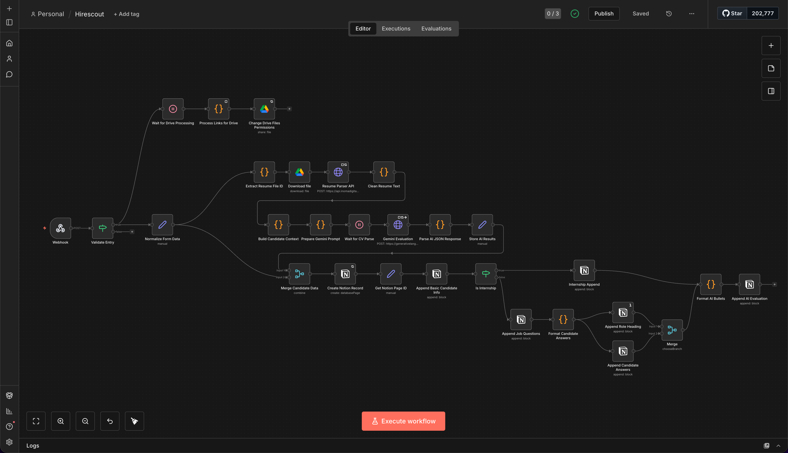
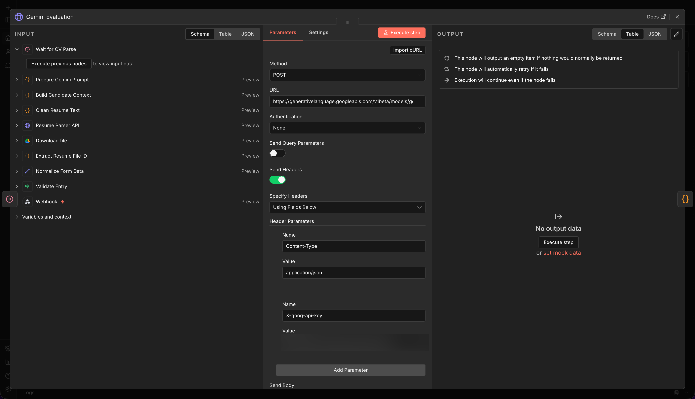
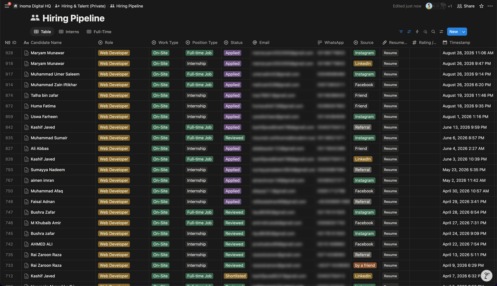

# hirescout

> AI-powered hiring pipeline built with self-hosted n8n, a custom resume parsing microservice, Gemini AI, and Notion — running in production at [Inoma Digital](https://inomadigital.com).


---

## What Problem This Solves

Inoma Digital receives applications across multiple roles through a public job posting at [inomadigital.com/apply](https://inomadigital.com/apply). Previously, every application meant someone on the team had to manually open the response sheet, download the CV, read through role-specific answers, score the candidate, and add them to a tracker. With a 15+ person team and ongoing hiring across multiple roles simultaneously, this was eating hours per cycle.

hirescout replaced the entire manual screening layer:

**Before:** Form submitted → someone checks the sheet → downloads CV → reads answers → manually scores → adds to Notion. Hours per batch.  
**After:** Form submitted → webhook fires → n8n validates, parses CV, evaluates with AI, builds structured Notion profile. Under 60 seconds. Zero manual steps.

---

## Architecture & Data Flow

```
Applicant submits at inomadigital.com/apply
              │
              ▼
      Google Forms (multi-page, role-conditional)
      Page 1: Name, Email, WhatsApp, City, CV upload, Source
      Page 2: Role-specific screening questions (Full-time only)
              │
              ▼
      Google Sheets (form response sync)
              │  webhook fires on new row
              ▼
┌──────────────────────────────────────────┐
│          Hetzner VPS (Ubuntu)            │
│                                          │
│   Nginx (SSL) ──► n8n (Docker :5678)    │
│                        │                 │
│                        │──► Resume       │
│                             Parser API   │
└──────────────────────────────────────────┘
              │
              ▼
    ┌─ If: candidate_name not empty? ─┐
    │ NO → drop (spam / empty hit)    │
    │ YES → continue                  │
    └─────────────────────────────────┘
              │
              ▼
       Normalize Form Data
              │
    ┌─────────┴──────────────────────┐
    │ [CV Branch]                    │ [AI Branch]
    │ Wait                           │ Build Candidate Context
    │ Process Drive Links            │ Prepare Gemini Prompt
    │ Change File Permissions        │ Wait
    │ Extract Resume File ID         │ Gemini AI Evaluation
    │ Download File                  │ Parse JSON Response
    │ Resume Parser API              │ Store AI Results
    │ Clean Resume Text              │
    └─────────────┬──────────────────┘
                  │
                  ▼
         Merge Candidate Data
                  │
                  ▼
       Create Notion Database Page
                  │
                  ▼
          Get Notion Page ID
                  │
          Append Basic Info
                  │
       ┌── Is Internship? ───┐
       │ YES                 │ NO
       ▼                     ▼
  Internship Details    Append Role Heading
  section               Format Candidate Answers
                        Append Job Questions
                             │
                        Format AI Bullets
                        Append AI Evaluation
                        Merge → done
```

### Key Components

| Component | Role |
|-----------|------|
| **Google Forms + Sheets** | Multi-page application intake with role-conditional sections |
| **n8n Webhook** | Triggered on every new Google Sheets row |
| **If node** | Validity gate — drops empty or spam webhook hits on `candidate_name` |
| **Google Drive nodes** | Changes CV file permissions before download to ensure access |
| **Resume Parser API** | Custom microservice on Hetzner — extracts and normalizes text from PDF, DOCX, and image CVs |
| **Gemini AI** | Scores candidate 0–100, returns strengths, weaknesses, and recommendation |
| **Notion** | Candidate CRM — full structured page per applicant, not just a database row |

---

## Screenshots

### Workflow Canvas


### Gemini Evaluation Node


### Notion Candidate Database


### Candidate Profile — Full-time


### Candidate Profile — Internship


---

## Two Candidate Types

The form serves both **full-time** and **internship** applicants in one form with conditional page routing. The workflow detects position type and builds a different Notion profile for each.

**Full-time candidates** receive a full structured profile:
- 🧾 Basic Information (name, email, WhatsApp, city, source, role, work type)
- 📎 Resume link
- 💼 Job Details (availability, salary range, one-year commitment)
- ⭕️ Role Questions (role-specific screening answers)
- 🤖 AI Evaluation (score, strengths, weaknesses, recommendation)

**Internship candidates** receive a simpler profile:
- 🧾 Basic Information
- 📎 Resume link
- 🎓 Internship Details (student/graduate status, office availability, 3-month commitment)
- 🤖 AI Evaluation (resume-only, no screening questions)

---

## Production Reliability

485 executions in production with a **0% failure rate**. This is a result of deliberate error handling in the workflow — not luck:

- The Gemini node is configured with **5 retries**, 5-second gaps between attempts, and `continueRegularOutput` on final failure — meaning even if AI evaluation is completely unavailable, the candidate still gets written to Notion without crashing the pipeline
- The Drive permissions node runs as a side-effect branch — if it fails, it doesn't block the main data flow
- The validity gate at entry drops malformed webhook hits before any API calls are made

Average execution time: ~30 seconds end-to-end.

---

## Gemini AI Evaluation

The AI node receives the full candidate context — normalized form data combined with clean extracted CV text — and returns a structured JSON evaluation. The prompt instructs the model to return JSON only with no surrounding text.

```json
{
  "score": 88,
  "strengths": ["strength 1", "strength 2"],
  "weaknesses": ["weakness 1"],
  "recommendation": "Interview"
}
```

`recommendation` is always one of: `Reject` · `Review` · `Interview`

Score is 0–100. Output maps directly into the AI Evaluation section of the Notion candidate page.

---

## Resume Parser Microservice

A custom API service deployed on the Hetzner VPS handles CV parsing independently of n8n. It accepts PDF, DOCX, and image file inputs, extracts text content, and normalizes whitespace and formatting before returning clean text to the workflow. This keeps candidate CV data on Inoma's own infrastructure rather than routing it through a third-party parsing service.

Endpoint (sanitized): `https://api.yourdomain.com/parse-resume`

---

## Repository Structure

```
hirescout/
├── README.md
├── workflow.json              # Sanitized n8n workflow export (~20 nodes)
├── screenshots/
│   ├── workflow-overview.png
│   ├── gemini-node.png
│   ├── notion-database.png
│   ├── notion-entry-fulltime.png
│   └── notion-entry-internship.png
└── docs/
    ├── SETUP.md
    └── ARCHITECTURE.md
```

---

## Setup Guide

See **[docs/SETUP.md](docs/SETUP.md)** — covers self-hosting n8n on a VPS, connecting Google Sheets via webhook, configuring Google Drive access, deploying the resume parser microservice, setting up Gemini API, and configuring Notion.

---

## Tech Stack

- **[n8n](https://n8n.io)** — self-hosted workflow automation (Docker on Ubuntu)
- **Google Forms + Sheets** — application intake and webhook trigger source
- **Google Drive API** — CV file access and permission management
- **Custom Resume Parser** — self-built microservice for PDF/DOCX/image text extraction
- **Gemini 2.5 Flash** (Google AI Studio) — candidate evaluation and scoring
- **Notion API** — structured candidate CRM with full per-applicant profile pages
- **Hetzner Cloud VPS** — hosts both n8n instance and resume parser microservice
- **Nginx** — reverse proxy with SSL termination

---

## About

Built by **Umair Umar**, Co-Founder of [Inoma Digital](https://inomadigital.com) — a full-service digital agency (Google Ads, SEO, Shopify, Web Development) with a 15+ member team serving US and international clients.

- GitHub: [@umairumd](https://github.com/umairumd)
- Agency: [inomadigital.com](https://inomadigital.com)

---

## License

MIT — adapt it for your own hiring pipeline.
